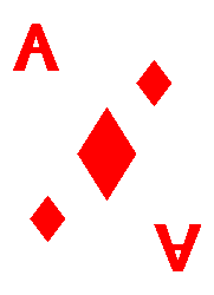

# Computer Science Elective 2024
This repository contains all of the study materials for the RHCDS 2024 Computer Science Elective.

## Day 1
### &nbsp;&nbsp;&nbsp;&nbsp;&nbsp;&nbsp;&nbsp;&nbsp;Introduction to Python

 &nbsp;&nbsp;&nbsp;&nbsp;&nbsp;&nbsp;&nbsp;&nbsp; The first day is a quick overview of coding before we dive straight into python.  The first activity we do is "What Would Python Display?" (WWPD), which is a way to get students to start comprehending what code is and how it's structured.  The second activity is "PythonIntro" which is a group of python functions for the students to work through.  There are extra functions at the bottom of the file for those that want something a little harder to work on.

### Activity List:
- Coding Crash Course
- What Would Python Display? (WWPD)
- Python Introduction Functions

## Day 2
### &nbsp;&nbsp;&nbsp;&nbsp;&nbsp;&nbsp;&nbsp;&nbsp;Rock Paper Scissors

 &nbsp;&nbsp;&nbsp;&nbsp;&nbsp;&nbsp;&nbsp;&nbsp; The second day we'll start it with a class-wide rock paper scissors game.  After that is done, we'll move onto the rock paper scissors python game.  The rock paper scissors python game is a premade game with some of the logic stripped away, leaving a skeleton to be filled in.  Before we start the game, we'll do an overview of all the problems on the game before letting them free to try and fix the game.

  

### Activity List:
- Rock Paper Scissors Tournament (Conga Line)
- Rock Paper Scissors in Python

## Day 3
### &nbsp;&nbsp;&nbsp;&nbsp;&nbsp;&nbsp;&nbsp;&nbsp;Pygame Zero and Flappy Bird

 &nbsp;&nbsp;&nbsp;&nbsp;&nbsp;&nbsp;&nbsp;&nbsp; The third day is where we introduce the idea of packages.  The package of choice is a simple one known as pygame zero, and it can allow us to make an actual game.  The focus will be on looking over the flappy bird project, solving the functions that have been removed, and customizing the game.

  

### Activity List:
- Flappy Bird in Pygame Zero

## Day 4
### &nbsp;&nbsp;&nbsp;&nbsp;&nbsp;&nbsp;&nbsp;&nbsp;Intro to Java Graphics

 &nbsp;&nbsp;&nbsp;&nbsp;&nbsp;&nbsp;&nbsp;&nbsp; On the fourth day we will transition from Python to Java and introduce everyone to our main Java project for this class. The project will be focused on using code to combine different shapes to make fun graphics!

  

### Activity List:
- Introduction to Java

## Day 5
### &nbsp;&nbsp;&nbsp;&nbsp;&nbsp;&nbsp;&nbsp;&nbsp;Project Worktime for Java Graphics

 &nbsp;&nbsp;&nbsp;&nbsp;&nbsp;&nbsp;&nbsp;&nbsp; Day 5 will be a full work period to build out your Java projects and show your friends.

### Activity List:
- Project Worktime

### To Do's for this Repo:
- add pygame installation instructions to the teacher profile to streamline the process
